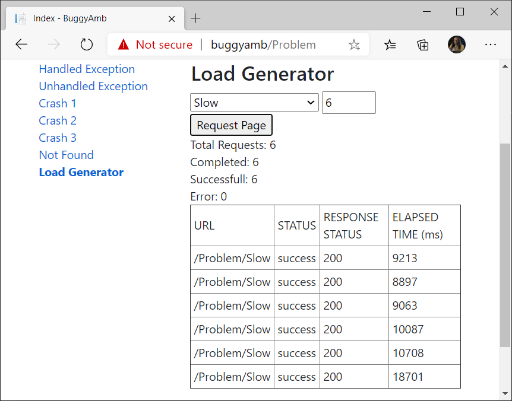
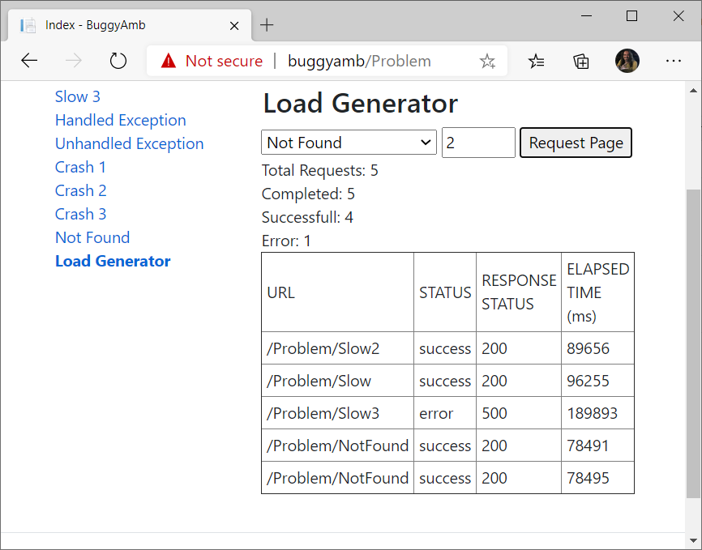
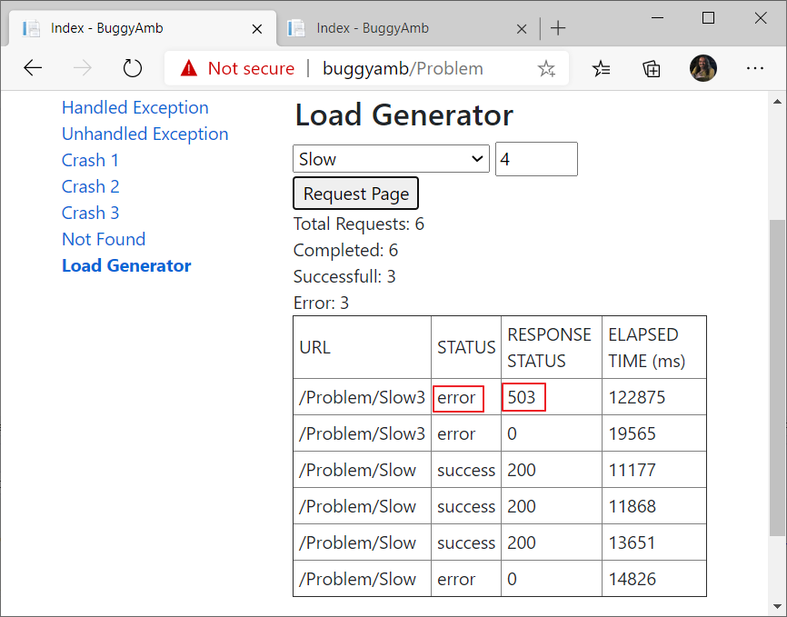

# Experimental "Load Generator"

"Load Generator" is nothing but some jQuery scripts that can send multiple requests to  different scenarios explained in the [quick tour](quick_tour.md):


It is not a rocket science, just select the page/scenario from list and tell how many requests you want to send there and click Request Page. Load Generator will add those requests in the list and show you if those are running or ended up sucessfully or gave an error. Elapsed time will tell how long it took to get the response:


Screenshot above tells me that there are two requests for ```/Problem/NotFound``` page, one is ended up with HTTP 200 and the other one is ended up with HTTP 404. There are two requests for ```/Problem/Slow``` and ```/Problem/Expected``` pages and both are ended up with HTTP 200 and the slow one took 8 seconds while the expected one took under 1 second. The request for ```/Problem/Slow3``` is still not responded. Note that the ```Status``` column is the status of Ajax request on client side, it is either success if the HTTP status code is HTTP 200 or error if the HTTP status code is other than HTTP 200 (e.g.: HTTP 404, HTTP 500). The actual response code is in the ```Response Status``` column.

>**Important:** Elapsed Time is the server time + client time. Remember the 6 concurrent Ajax request limit, if you have more than 6 requests still running in the list then the rest will be waiting on the browser's queue for making the actual call. Elapsed Time also counts those seconds / minutes spent in the browser queue while waiting for an available Ajax connection. It may be a good idea to show the time spent on client side queue in another column in the next release of BuggyAmb.

>>If, for some reason, you need more requests to test a scenario then there are workarounds: you can open an inPrivate browsing session and can have 6 more concurrent requests. Similarly, you can open one another vendor's browser to have another 6 concurrent request power.

## Sample Usage Scenarios

### Sending bulk requests to one single page

I often do this to reproduce the problem for the first slow scenario. If you make one request to the first slow scenario then you will see the page loads around 6-7 seconds or sometimes even faster where there are lots of CPU resources. In this kind of situations, where the response times are higher than expected but not long enough for capturing data for troubleshooting (e.g.: capturing multiple dumps with some intervals), it may be difficult to start troubleshooting. So we may want to have a larger window to capture data if it is possible. Of course this may not be possible for some real-world scenarios. However, we can do this "cheat" with BuggyAmb.

In the first slow scenario, as you may have already noticed, the CPU usage increases whenever a response is made and having more requests make it worse. So we want to send multiple requests. We can open new browser tabs and make the requests manually but why not using a tool to automate that? This is where I use Load Generator:

In the sample below I am sending 6 request to the page running the first slow scenario:



This gives me more time to monitor and troubleshoot the problem.

I know there is that 6 concurrent Ajax request limit in browsers but we can still send more than 6 requests (up to 25) to BuggyAmb in Load Generator. I bet you ask this question: what is the point when, say, 15 requests are sent to BuggyAmb if it just sends only 6 requests at one time? That is correct but keep in mind that browser keeps the requests in the queue when there are 6 Ajax requests and it will send the requests one by one whenever a one of the running requests are done. So the tool will keep sending requests to BuggyAmb and that will give you a lot of time for troubleshotting.

The sample below shows that 15 requests are sent to the the tool:


The first six requests seen in the table are sent first and then four of them are done so the next four requests are sent. Since there are six requests running at the moment, the last five requests will be sent in order once there is an available Ajax connection.

This will give me a lot of time for collecting data.

**Again:**

>If, for some reason, you need more requests to test a scenario then there are workarounds: you can open an inPrivate browsing session and can have 6 more concurrent requests. Similarly, you can open one another vendor's browser to have another 6 concurrent request power.

### Testing multiple scenarios at the same time

You may want to mix different scenarios by sending different requests to different parts of BuggyAmb. Below shows that there are five requests to different scenarios and one ended up with HTTP 500 after ~3 minutes while the others were done with HTTP 200 although the response times were high again:



Note that I opened an inPrivate browsing session and already sent some mixed requests to slow scenarios before running the test above. As you can see things really get worse when the number of the requests increase.

>Once again, Load Generator is experimental. It may be buggy than the actual server side code so try to use it within the six request browser limit to avoid confusions around the "elapsed time" seen in the page - remember that the "elapsed time" is the sum of client side and server side time. Of course you are welcome to workaround this limit but make sure that you are also checking the server side logs to make a conclusion for what the actual server side processing time is.

>If you look at the things from brighter side then you can take this limitation to test something else: you can push the limits and then try to find out how much time is spent on the client side and how much time is spent on the server side. You may practice your client side troubleshooting skills while you analyze this. For example, you can send 30 requests to different slow scenarios and nmaybe to the other pages as well and then capture a network trace or collect HTTP trace using tools like Fiddler, HttpWatch or browsers' developer toolbars. By looking at those traces you can try to understand where is the slowness, is that on client side, or is that on server side? This would be a good practice as well because you may see similar scenarios in some real-world problems.

### Testing crash scenarios

If you read the guidance for the crash scenarios in the [quick tour](quick_tour.md), you may remember that sometimes the crash issues are not visible to the end users. You can use the tool to observe the results of crash scenarios.

For example I made two requests to the third slow scenario and four requests to the first slow scenario after I clicked the second crash scenario, ```Crash 2``` and here is the result:



I got HTTP 503 - Sevice Unavailable error for one of my requests and there are other requests ended up with ```error```. I am hosting BuggyAmb on IIS and I may get HTTP 503 if the application pool is disabled or some limits are achieved (e.g.: queue is full). Queue should not be full because there are not too many requests so it should be a crash symptom and I can confirm that in event logs. 

This is how I monitor crash scenarios using Load Generator.
