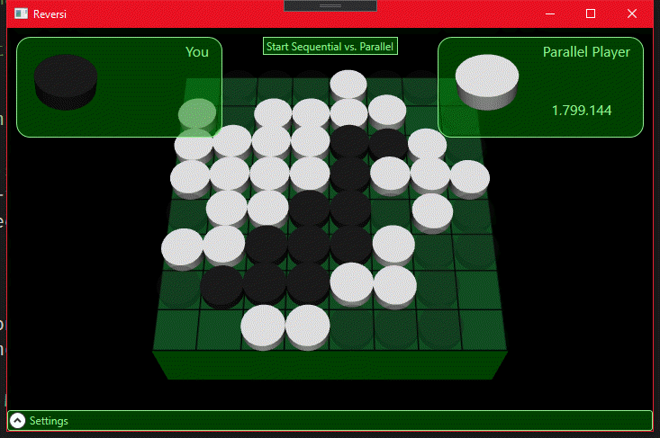

---
languages:
- csharp
products:
- dotnet-core
page_type: sample
name: ".NET Core parallel animated ray-traced bouncing ball"
urlFragment: "parallel-programming-winforms-raytracer-cs"
description: "A .NET Core WPF application that demonstrates AI algorithms using minimax with alpha-beta pruning and parallel AI."
---

# .NET Core parallel programming with PLINQ

The sample source code is a .NET Core WPF application written in C#, that demonstrates AI algorithms using minimax with alpha-beta pruning, and the parallel AI (light player) uses Tasks and CancellationTokens to achieve speedup via parallelism.

## Demo

## Sample prerequisites

This sample is written in C# and targets .NET Core 3.1. It requires the [.NET Core 3.1 SDK](https://dotnet.microsoft.com/download/dotnet-core/3.1).

## Types and members in use

The sample source code uses the following types and members:

- `Monitor.Enter`
- `Monitor.Exit`
- `CancellationTokenSource`
- `CancellationToken`
- `Queue<Task>`
- `Task.WaitAll`
- `Task.Run`
- `Task.Factory.StartNew`
- `TaskScheduler.FromCurrentSynchronizationContext`

## Building the sample

The source code includes an MSBuild project file for C# (a *.csproj* file) that targets .NET Core 3.1. After you download the *.zip* file containing the example code, create a directory and select **Download ZIP** to download the sample code files to your computer. To build the example:

1. Download the *.zip* file containing.
1. Create the directory to which you want to copy the files.
1. Copy the files from the *.zip* file to the directory you just created.
1. If you are using Visual Studio 2019:
   1. In Visual Studio, select **Open a project or solution** (or **File** > **Open** > **Project/Solution** from the Visual Studio menu.
   1. Select **Debug** > **Start Debugging** from the Visual Studio menu to build and launch the application.
1. If you are working from the command line:
   1. Navigate to the directory that contains the sample.
   1. Type in the command `dotnet run` to build and launch the application.
