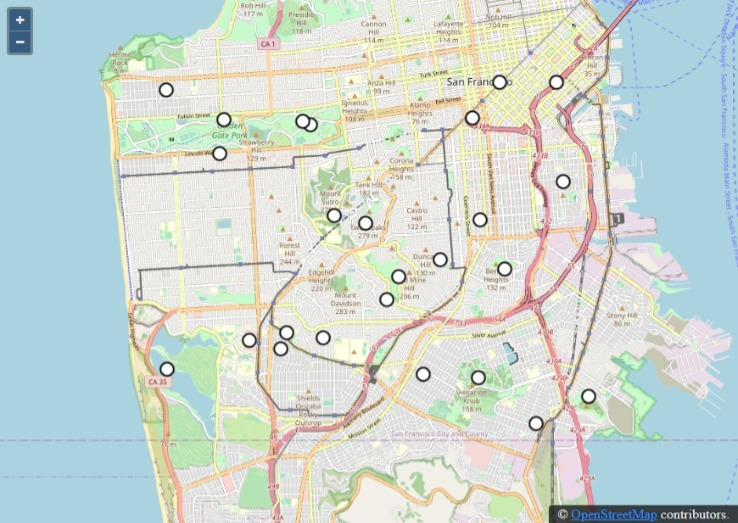
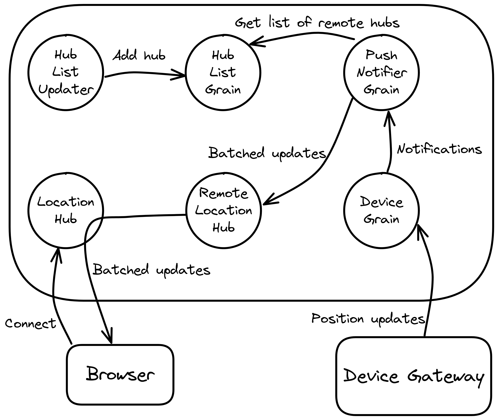
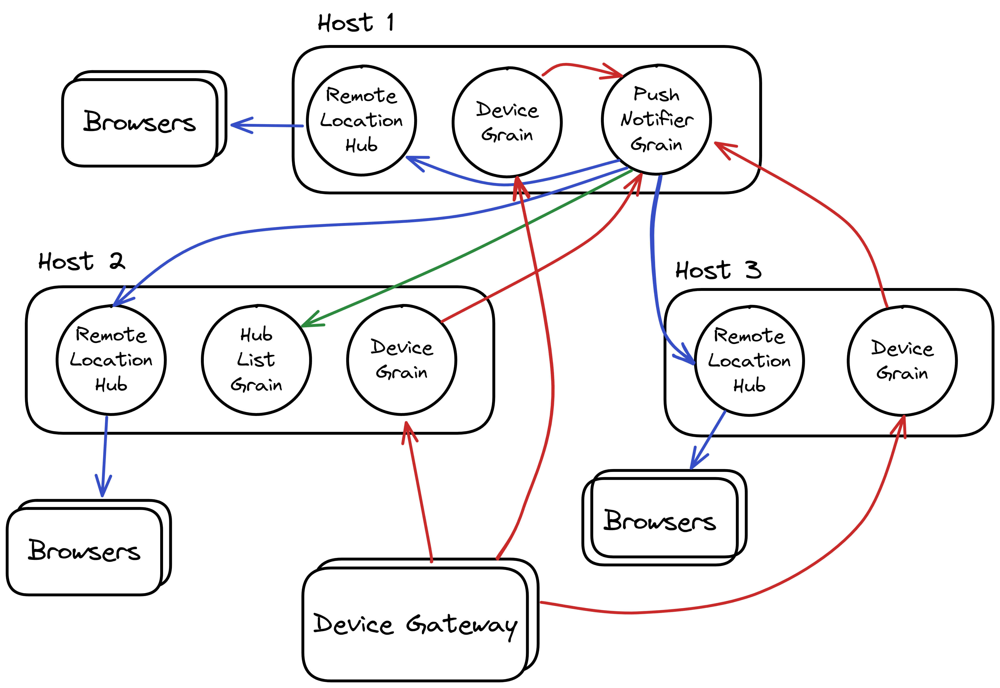

---
languages:
- csharp
products:
- dotnet
- dotnet-orleans
page_type: sample
name: "Orleans GPS device tracker sample"
urlFragment: "orleans-gps-device-tracker-sample"
description: "An Orleans sample demonstrating how to use GPS device tracker."
---

# Orleans GPS device tracker sample app

This sample demonstrates a service for tracking GPS-equipped IoT devices on a map. Device locations are updated in near-real-time using SignalR and hence this sample demonstrates one approach to integrating Orleans with SignalR. The device updates originate from a *device gateway*, which is implemented using a separate process that connects to the main service and simulates several devices moving in a pseudorandom fashion around an area of San Francisco.



Data flows around the system as follows:

* A device gateway sends periodic location updates to a per-device `DeviceGrain`
* The `DeviceGrain` updates a singleton `PushNotifierGrain` with its location
* The `PushNotifierGrain` collects these updates into batches and pushes them to `IRemoteLocationHub` instances which it discovers by periodically polling the singleton `HubListGrain`
* `HubListGrain` maintains a list containing an `IRemoteLocationHub` reference for each host which is connected to the Orleans cluster
* Each host has a `HubListUpdater` instance, which implements [`BackgroundService`](https://docs.microsoft.com/aspnet/core/fundamentals/host/hosted-services#backgroundservice-base-class) and periodically updates `HubListGrain` with its local `IRemoteLocationHub` reference.
* The `RemoteLocationHub` class which implements `IRemoteLocationHub` has an instance of [`IHubContext<LocationHub>`](https://docs.microsoft.com/aspnet/core/signalr/hubcontext) injected into its constructor. This allows it to send messages to the Web clients which have connected to the `LocationHub`.

The following diagram is a representation of the above description:



The following is an example of how this might look with multiple hosts and many browsers. Note that the `PushNotifierGrain` and `HubListGrain` are singletons and therefore there is one instance of each of those grains shared by the cluster. Singleton grains are a pattern in Orleans whereby only a single grain of a given type is accessed, for example by always calling the instance with a key `0` or `Guid.Empty` or some other fixed value, depending on if the grain is an `IGrainWithIntegerKey` or `IGrainWithGuidKey`. For example, each `DeviceGrain` gets an instance of the `IPushNotifierGrain` with id `0`:

```csharp
var notifier = GrainFactory.GetGrain<IPushNotifierGrain>(0);
```



## Sample prerequisites

This sample is written in C# and targets .NET 7.0. It requires the [.NET 7.0 SDK](https://dotnet.microsoft.com/download/dotnet/7.0) or later.

## Building the sample

To download and run the sample, follow these steps:

1. Download and unzip the sample.
2. In Visual Studio (2022 or later):
    1. On the menu bar, choose **File** > **Open** > **Project/Solution**.
    2. Navigate to the folder that holds the unzipped sample code, and open the C# project (.csproj) file.
    3. Choose the <kbd>F5</kbd> key to run with debugging, or <kbd>Ctrl</kbd>+<kbd>F5</kbd> keys to run the project without debugging.
3. From the command line:
   1. Navigate to the folder that holds the unzipped sample code.
   2. At the command line, type [`dotnet run`](https://docs.microsoft.com/dotnet/core/tools/dotnet-run).

Open three terminal windows. In the first terminal window, run the following at the command prompt:

```dotnetcli
dotnet run --project GPSTracker.Service
```

In the second terminal, launch another instance of the host, specifying that it's the second host by passing an `InstanceId` value as follows:

```dotnetcli
dotnet run --project GPSTracker.Service -- --InstanceId 1
```

Now open a web browser to `http://localhost:5001/index.html`. At this point, there will be no points moving around the map.

In the third terminal window, run the following at the command prompt to begin simulating devices:

```dotnetcli
dotnet run --project GPSTracker.FakeDeviceGateway
```

Dots will appear on the map in the Web browser and begin moving randomly around the area.

## Orleans observability

If you're interested in observability, this sample includes some optional logging, metrics, and distributed tracing.

```docker
docker run -p 9090:9090 -v ..\dotnet\samples\GPSTracker\prometheus.yml:/etc/prometheus/prometheus.yml prom/prometheus
```

```docker
docker run -d --name jaeger -e COLLECTOR_ZIPKIN_HOST_PORT=:9411 -p 5775:5775/udp -p 6831:6831/udp -p 6832:6832/udp -p 5778:5778 -p 16686:16686 -p 14268:14268 -p 14250:14250 -p 9411:9411 jaegertracing/all-in-one:1.22
```

OR zipkin: 

```docker
docker run -p 9411:9411 openzipkin/zipkin
```
